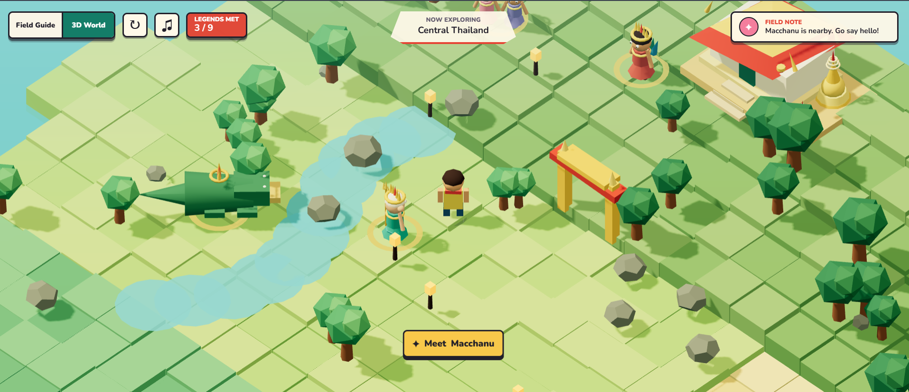

# Thai Mythidex

A playful Pokedex-inspired field guide and 3D adventure featuring mythical and
legendary characters from across Thailand.

**Live app:** [andrewliew86.github.io/Thai-mythical-creatures-pokedex](https://andrewliew86.github.io/Thai-mythical-creatures-pokedex/)



## Features

### Field Guide

- Browse legends from Central, Northern, Southern, and Eastern Thailand.
- Read short origin stories, lore ages, powers, dimensions, and folklore stats.
- Store and extend all character information in a simple CSV file.
- Use responsive layouts designed for desktop and mobile screens.

### 3D World

- Explore a procedurally generated isometric world with rivers, forests, beaches,
  Thai temples, pagodas, shrines, and an offshore pier.
- Meet nine distinct low-poly 3D folklore characters in environments connected to
  their stories.
- Discover a character by approaching them, then open their description, powers,
  measurements, and stats.
- Listen to an original Thai-inspired chiptune soundtrack with plucked melodies,
  bass, and gong accents.
- Move with WASD or the arrow keys, press E to meet a nearby legend, and press R
  to return to the trailhead.
- Use the on-screen directional controls on touch devices.

## Project Structure

- `index.html`, `styles.css`, and `app.js` power the Field Guide.
- `explore.html`, `explore.css`, and `explore.js` power the Three.js 3D World.
- `data/creatures.csv` stores the folklore entries.
- `assets/creatures/*.png` stores the Field Guide character portraits.
- `assets/screenshots/` stores README and project screenshots.

The project is entirely static and can be hosted directly on GitHub Pages.

## Run Locally

Start a small static server from the repository root:

```bash
python -m http.server 8000
```

Open the Field Guide at `http://localhost:8000` or open the 3D World directly at
`http://localhost:8000/explore.html`.

## Add a New Character

1. Add a row to `data/creatures.csv`.
2. Put a matching portrait PNG in `assets/creatures`.
3. Set the row's `image` value, for example
   `assets/creatures/new-legend.png`.
4. Add the character's world position and 3D model factory in `explore.js`.

Keep values containing commas inside quotes, such as
`"Songkhla, Pattani, and sea routes"`.

## Publish on GitHub Pages

1. Push the project to the `main` branch.
2. Open **Settings > Pages** in the GitHub repository.
3. Choose **Deploy from a branch**.
4. Select `main` and `/root`, then save.
